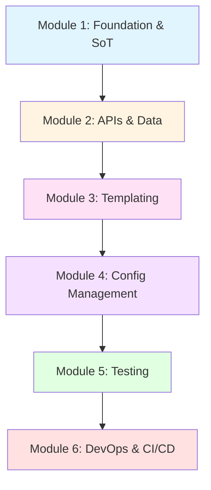

<!--
author:   Alex "The Automator" Rivera
email:    alex.rivera@packetcoders.io
version:  1.0.0
language: en
narrator: English Male
comment:  Python Network Automation Bootcamp - From CLI Artisan to Network Reliability Engineer

logo:     https://raw.githubusercontent.com/LiaScript/LiaScript/master/badges/course.svg

link:     https://cdn.jsdelivr.net/chartist.js/latest/chartist.min.css
script:   https://cdn.jsdelivr.net/chartist.js/latest/chartist.min.js

@mermaid: @mermaid_eval(@uid,```@0```)

@mermaid_eval
<script run-once="true" modify="false">
mermaid.initialize({});

let def = `@1`.replace(/```/g, "");

mermaid.render("mermaid_@0", def, (err, svg) => {
  if (err) {
    console.error("Mermaid error:", err);
    send.lia("LIA: stop");
  } else {
    send.lia(svg);
    send.lia("LIA: stop");
  }
});
"loading graph...";
</script>
@end
-->

# Python Network Automation Bootcamp

    --{{0}}--
Welcome to the Python Network Automation Bootcamp!
This intensive 41-hour journey will transform you from a CLI artisan into a network reliability engineer.
I'm Alex Rivera, and I've automated myself out of a job three times.
That's exactly what I want for you.

## Course Overview

    --{{0}}--
This bootcamp is designed for network engineers ready to embrace automation.
We'll cover the entire automation ecosystem, from Source of Truth to CI/CD pipelines.

      {{0-1}}
**Target Audience:** Network Engineers & IT Professionals

      {{0-1}}
- CCNA/CCNP level networking foundation
- Command-line comfortable
- No Python experience required
- Ready to level up

      {{1-2}}
**What You'll Learn:**

      {{1-2}}
1. **Model & Validate** - NetBox Source of Truth + JSON Schema
2. **Automate & Test** - Ansible + pyATS + Batfish
3. **Version Control** - Git & GitHub workflows
4. **CI/CD Pipelines** - Complete automation loops
5. **API Integration** - REST & GraphQL mastery

      {{2-3}}
**Time Commitment:** 40-50 hours total (41 hours of content)

      {{2-3}}
- 11 sessions
- 8 hands-on labs
- 1 capstone project
- "Learn by doing" approach (80% labs, 20% theory)

## Course Structure

    --{{0}}--
The bootcamp is organized into six progressive modules.
Each session builds on previous knowledge, so don't skip ahead.



### Module 1: Foundation & Source of Truth

#### [Session 1: Introduction to Network Automation](materials/1-lecture.md)

**Duration:** 2 hours | **Type:** Lecture

    --{{0}}--
We start by answering the fundamental question: Why automate?
You'll see real horror stories, calculate ROI, and understand the core principles that separate good automation from dangerous scripts.

**Key Topics:**

- The "Artisan Network" problem
- Infrastructure as Code (IaC) principles
- Source of Truth, Declarative configs, Idempotency
- The automation toolkit landscape

**Highlights:**

- 💥 Friday 4:47 PM disaster (516 manual commands)
- 💰 ROI calculation: 8.3h → 2h (save 75% of your time)
- 🔄 Idempotency visualization with code examples

---

#### [Session 2: NetBox as Source of Truth](materials/2-lab.md)

**Duration:** 4 hours | **Type:** Lab

    --{{0}}--
Excel is not a database. NetBox is your network's single source of truth.
In this lab, you'll model a complete data center environment.

**Key Topics:**

- Sites, Racks, Device Types
- IPAM (IP Address Management)
- VRFs and network segmentation
- Custom fields and tagging

**Highlights:**

- 📊 Excel IP conflict war story (10.1.10.11 duplicate, 6h troubleshooting)
- 🏗️ Data hierarchy Mermaid diagram
- 🖥️ 42U rack ASCII visualization
- ⚠️ 5 common mistakes + 5 best practices

---

### Module 2: Programmatic Access & Data

#### [Session 3: Mastering REST APIs with Python](materials/3-lab.md)

**Duration:** 4 hours | **Type:** Lab

    --{{0}}--
Stop clicking through GUIs. Learn to interact with NetBox and network devices programmatically using REST APIs.

**Key Topics:**

- HTTP fundamentals (GET, POST, PUT, DELETE)
- Authentication & authorization
- Python `requests` library
- Pagination, rate limiting, error handling

**Highlights:**

- ⚡ 500-device audit: 3h clicking → 30s script
- 📈 REST request/response flow diagram
- 🔧 Advanced features: sessions, retries, exponential backoff
- ⚠️ 5 common mistakes + 5 best practices

---

#### [Session 4: GraphQL - The Efficient Alternative](materials/4-lab.md)

**Duration:** 3 hours | **Type:** Lab

    --{{0}}--
REST is powerful but inefficient. GraphQL lets you fetch exactly the data you need in a single request.

**Key Topics:**

- GraphQL vs REST comparison
- Query structure and syntax
- Fragments, variables, aliases
- NetBox GraphQL integration

**Highlights:**

- 🚀 22x performance improvement (1000+ REST requests/45s vs 1 GraphQL/2s)
- 📊 Visual comparison diagrams
- 🎯 Query shape ASCII diagram
- 📚 When to use REST vs GraphQL decision guide

---

### Module 3: Templating & Configuration Generation

#### [Session 5: Jinja2 Templating](materials/5-lab.md)

**Duration:** 4 hours | **Type:** Lab

    --{{0}}--
Separate data from logic. Generate configurations from templates instead of copy-pasting with find-replace.

**Key Topics:**

- Variables, filters, loops, conditionals
- Template inheritance
- Macros (functions for templates)
- NetBox integration

**Highlights:**

- ⚡ 50-switch deployment: 3h manual → 10s automated
- 🏗️ Complete template inheritance examples
- 🔧 Macro definitions with real use cases
- 📚 6 best practices including custom filters

---

#### [Session 6: Data Validation with JSON Schema](materials/6-exercise.md)

**Duration:** 2 hours | **Type:** Exercise

    --{{0}}--
Defensive engineering: Validate your data before it breaks the network.

**Key Topics:**

- JSON Schema fundamentals
- Type systems and constraints
- Python validation with `jsonschema`
- Integration with config generation

**Highlights:**

- 💥 VLAN "10O" disaster (200 switches, 3h frozen network)
- 🛡️ Validation urgency with cost breakdown
- 🔍 Schema examples for network data

---

### Module 4: Configuration Management

#### [Session 7: Ansible for Network Engineers](materials/7-lab.md)

**Duration:** 6 hours | **Type:** Lab

    --{{0}}--
Ansible is your force multiplier. Manage hundreds of devices with the same effort as managing one.

**Key Topics:**

- Inventory (static & dynamic from NetBox)
- Playbooks, tasks, modules
- Network-specific modules
- Resource modules with 7 states
- Connection plugins (network_cli, netconf, httpapi)

**Highlights:**

- ⚡ 200 routers: 200min manual → 20min Ansible
- 🔧 7 resource module states explained
- 🔌 Connection plugin comparison
- 📚 Idempotency in practice

---

### Module 5: Network Testing & Assurance

#### [Session 8: Pre-Change Testing with Batfish](materials/8-lab.md)

**Duration:** 4 hours | **Type:** Lab

    --{{0}}--
Test changes before deploying to production. Batfish models your network and answers "what if" questions.

**Key Topics:**

- Network modeling and snapshots
- Reachability analysis
- ACL and firewall testing
- Routing protocol validation
- Differential analysis (before/after)

**Highlights:**

- 💥 Friday 5PM ACL failure (production down at 5:02 PM)
- 🔮 Comprehensive question types list
- 🔄 Differential analysis workflow

---

#### [Session 9: Post-Change Testing with pyATS](materials/9-lab.md)

**Duration:** 4 hours | **Type:** Lab

    --{{0}}--
Verify the actual state of your network. pyATS automates post-change validation at scale.

**Key Topics:**

- pyATS ecosystem overview
- Genie parsers (CLI → structured data)
- Learn and Diff functionality
- AEtest framework for test automation
- Testbed configuration

**Highlights:**

- ⚡ 100 devices: 4h manual → 2min pyATS (100% accuracy)
- 🧬 Learn/Diff code examples
- 🧪 AEtest framework structure
- 📊 Automated verification workflows

---

### Module 6: DevOps & Pipelines

#### [Session 10: Git & Version Control](materials/10-lab.md)

**Duration:** 3 hours | **Type:** Lab

    --{{0}}--
Infrastructure as Code means code. And code needs version control.

**Key Topics:**

- Git fundamentals (add, commit, push, pull)
- Branching strategies
- Pull requests and code review
- Merge vs rebase
- Workflow comparison

**Highlights:**

- 💥 2AM script panic (5 versions with confusing names)
- 🌿 4 workflow strategies compared (Feature Branch, Gitflow, Trunk-Based, GitHub Flow)
- 🔀 Merge vs rebase explained
- 📚 Collaboration best practices

---

#### [Session 11: CI/CD Pipelines (Capstone)](materials/11-capstone.md)

**Duration:** 5 hours | **Type:** Capstone Project

    --{{0}}--
The Golden Loop: Bringing everything together into a complete automation pipeline.

**Key Topics:**

- GitHub Actions fundamentals
- Complete pipeline architecture
- Workflow file syntax
- Integration: Lint → Validate → Simulate → Deploy → Verify → Notify
- Advanced features (secrets, environments, matrix builds)

**Highlights:**

- ⚡ Manual (7 steps, 20min, error-prone) → CI/CD (automated, 4min, zero human involvement)
- 🏗️ Complete pipeline architecture diagram
- 🔧 Real-world workflow file
- 🎯 End-to-end automation

---

## Learning Outcomes

    --{{0}}--
By the end of this bootcamp, you will have built a complete automation pipeline integrating all the tools.

      {{0-1}}
**You will be able to:**

      {{0-1}}
✅ Model your network in NetBox as a single source of truth  
✅ Query data programmatically using REST and GraphQL APIs  
✅ Generate configurations from templates using Jinja2  
✅ Validate data with JSON Schema before deployment  
✅ Automate deployments with Ansible at scale  
✅ Test changes before deployment with Batfish  
✅ Verify network state after changes with pyATS  
✅ Manage infrastructure as code with Git  
✅ Build CI/CD pipelines with GitHub Actions  

      {{1-2}}
**Real-World Impact:**

      {{1-2}}
| Task | Manual Time | Automated Time | Improvement |
|------|-------------|----------------|-------------|
| 50-switch config deploy | 3 hours | 10 seconds | **1080x** faster |
| 500-device audit | 3 hours | 30 seconds | **360x** faster |
| 100-device verification | 4 hours | 2 minutes | **120x** faster |
| GraphQL vs REST query | 45 seconds | 2 seconds | **22x** faster |
| 200-router BGP update | 200 minutes | 20 minutes | **10x** faster |

## Prerequisites

    --{{0}}--
You don't need to be a programmer, but you should have solid networking fundamentals.

**Required:**

- Networking knowledge (CCNA/CCNP level)
- Command-line comfort (SSH, basic shell commands)
- Ability to read configuration files

**Helpful but not required:**

- Basic Python exposure
- Git familiarity
- Any scripting experience

**Lab Requirements:**

- Computer with VS Code or similar editor
- Access to lab environment (NetBox, Git, network devices)
- Python 3.8+ installed

## Teaching Methodology

    --{{0}}--
This is not a lecture course. This is a bootcamp.
You will spend eighty percent of your time coding, not watching slides.

**The 4-Phase Learning Cycle:**

1. **Concept** - Brief introduction (Why do we need this?)
2. **Demonstration** - Live coding walkthrough
3. **Lab/Practice** - You solve a real-world scenario
4. **Integration** - Connect with previous tools

**Course Style:**

- ✅ Practical, production-ready code
- ✅ Real disaster scenarios as motivation
- ✅ Quantified value (ROI calculations, time savings)
- ✅ Common pitfalls and how to avoid them
- ✅ Best practices from industry experience

**Professor's Motto:**

> "If you do it more than twice, automate it—but test it first."  
> — Alex "The Automator" Rivera

## How to Navigate This Course

    --{{0}}--
Each session builds on the previous one. Don't skip sessions.

**For Students:**

1. Read the session material in order
2. Complete every lab exercise
3. Study the "horror stories" to learn what NOT to do
4. Apply the best practices in your own environment
5. Build the capstone project using all the tools

**For Instructors:**

1. Review the [Lecture Outline](docs/lecture-outline.md) for course goals
2. Study the [Lecture Didactics](docs/lecture-didactics.md) for teaching approach
3. Follow the [Lecture Agenda](docs/lecture-agenda.md) for session structure
4. Customize materials to your specific audience
5. Use the [Validation Report](docs/validation-report.md) for quality assurance

**For Self-Learners:**

- Set up your own lab environment (see Session 1)
- Work through sessions at your own pace
- Join the community (links in each session)
- Share your automation wins!

## Additional Resources

**Documentation:**

- [Complete Bundle Index](lecture-bundle/bundle-index.md)
- [Validation Report](docs/validation-report.md)
- [Content Enhancement Progress](docs/content-enhancement-progress.md)

**Skeletons (for instructors):**

- Development templates are available in `skeletons/` folder
- Use these as frameworks for customizing content

**Support:**

- Each session includes references and external resources
- See session materials for specific tool documentation

## License

This course is licensed under CC1.0 Universal.

---

## Ready to Start?

    --{{0}}--
Time to stop being a CLI artisan and start being a network reliability engineer.
Let's begin with Session 1.

**[→ Begin Session 1: Introduction to Network Automation](materials/1-lecture.md)**

---

*Python Network Automation Bootcamp v1.0.0*  
*Created with Teaching-Agent using the BMad-Method Framework*  
*Last Updated: 2026-02-05*
