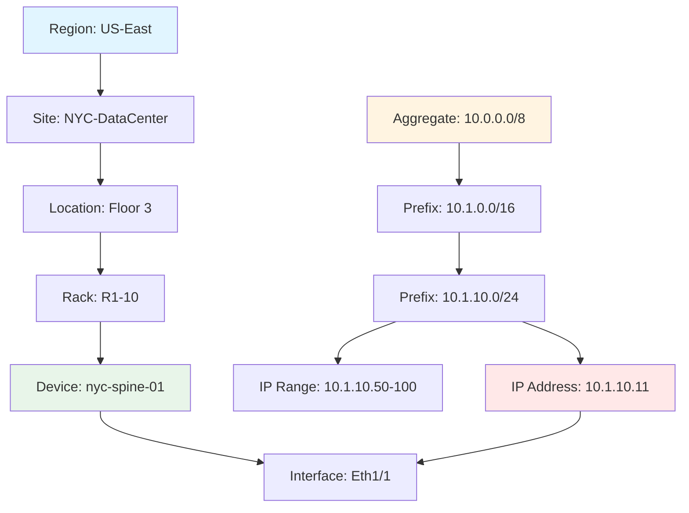

<!--
author:   Alex "The Automator" Rivera
email:    alex.rivera@packetcoders.io
version:  1.0.0
language: en
narrator: English Male
comment:  Building the Source of Truth with NetBox.
-->

# Session 2: NetBox as Source of Truth

## Introduction: No More Spreadsheets

    --{{0}}--
    Welcome back. Today we kill the spreadsheet.
    If you are tracking your IP addresses in Excel, you are doing it wrong.
    Excel doesn't have an API. Excel doesn't enforce uniqueness. Excel is where data goes to die.

    --{{1}}--
    Let me tell you a war story. December 2023. A colleague is managing IPs in Excel.
    He assigns 10.1.10.11 to the new firewall. Saves the file. Two weeks later, the network starts having weird intermittent issues.
    Packets dropping. Sessions timing out. Random.

    --{{2}}--
    Six hours of troubleshooting later, we discover: 10.1.10.11 is ALSO assigned to the core switch.
    Someone else edited the same Excel file. Both devices were using the same IP. ARP cache chaos.
    Excel didn't stop them. Excel doesn't know what an IP conflict is.

    --{{3}}--
    NetBox would have rejected that duplicate IP the instant you tried to save it.
    That's six hours of your life you get back. That's the difference between a database and a spreadsheet.

    {{3}}
> **Reality Check**: Excel is a tool for accountants. NetBox is a tool for network engineers.

    --{{4}}--
    Today we implement **NetBox**, the premier network source of truth.
    Built specifically for network engineers, NetBox combines IP Address Management (IPAM) and Data Center Infrastructure Management (DCIM) into one powerful platform.
    Unlike general-purpose CMDBs, NetBox has a curated data model designed specifically for infrastructure design and documentation.

    --{{2}}--
    NetBox is more than just a database. It provides:
    - Hierarchical regions, sites, and locations
    - Racks, devices, and device components
    - Cables and wireless connections
    - Power distribution tracking
    - Data circuits and providers
    - Virtual machines and clusters
    - IP prefixes, ranges, and addresses
    - VRFs and route targets
    - VLANs and L2VPN overlays

    --{{3}}--
    It's the authoritative state of our network.
    If it's not in NetBox, it doesn't exist.

    --{{4}}--
    NetBox organizes everything hierarchically. Think of it like a file system for your infrastructure.

    {{4}}
### NetBox Data Hierarchy


    --{{5}}--
    **Left side**: Physical hierarchy - where your gear lives.
    **Right side**: Logical hierarchy - how your IPs are organized.
    **The magic**: They connect. IP 10.1.10.11 is assigned to Interface Eth1/1 on Device nyc-spine-01.

## Lab 2.1: Defining the Physical World

    --{{0}}--
    First, we need to tell NetBox where our gear lives.
    Networking is physical (mostly).

    --{{1}}--
    Go to **Organization** > **Sites**.
    Create a new site: `NYC-DataCenter`.
    Region: `US-East`.
    Time Zone: `US/Eastern`.
 - the blueprint for hardware.
    We don't want to type "48 ports" every time we add a switch.

    --{{1}}--
    NetBox uses a powerful templating system. A Device Type defines:
    - Physical dimensions (rack units, weight)
    - Power requirements
    - Interface templates (ports, console ports, power ports)
    - Module bays for modular devices
    - Front and rear port mappings

    --{{2}}--
    **Devices** > **Device Types**.
    Create a new manufacturer and device type:
    *   Manufacturer: `Cisco`
    *   Model: `Nexus 9300`
    *   Height: 1U
    *   Part Number: `N9K-C9300`

    --{{3}}--
    Now add the **Interface Templates** to the Device Type.
    *   `Eth1/1` to `Eth1/48` (10G SFP+, Type: 10GBASE-X-SFP+)
    *   `Eth1/49` to `Eth1/54` (40G QSFP, Type: 40GBASE-X-QSFP+)
    *   `mgmt0` (Management interface, Type: 1000BASE-T
    --{{0}}--
    Before we can add a router, we need to explain to NetBox what a "router" is.
    This is called a **Device Type**. It's a template.
    We don't want to type "48 ports" every time we add a switch.

    --{{1}}--
    **Devices** > **Device Types**.
    Create:
    *   Manufacturer: `Cisco`
    *   Model: `Nexus 9300`
    *   Height: 1U

    --{{2}}--
    Now add the **Interface Templates** to the Device Type.
    *   `Eth1/1` to `Eth1/48` (10G SFP+)
    *   `Eth1/49` to `Eth1/54` (40G QSFP)

    {{1}}
> **Task**: Model a `Cisco Nexus 9300` with 48x10G and 6x40G ports.

## Lab 2.3: Rack 'Em and Stack 'Em

    --{{0}}--
    Now we have a Site, a Rack, and a Model.
    Let's deploy.

    --{{1}}--
    **Devices** > **Devices** > **Add**.
    *   Name: `nyc-spine-01`
    *   Role: `Spine Switch`
    *   Type: `Nexus 9300`
    *   Site: `NYC-DataCenter`
    *   Rack: `R1-10`, Position: `42` (Top of Rack)

    --{{2}}--
    Look at the **Rack Elevation** view. It's beautiful, right?
    Adding things here gives them a unique ID that we will query later with python.

    --{{3}}--
    Your rack should look something like this:

    {{3}}
```ascii
╔═══════════════════════════════════╗
║  Rack R1-10 - NYC DataCenter      ║
╠═══════════════════════════════════╣
║ U42 ║█████████████████████████║    ← nyc-spine-01 (Nexus 9300)
║ U41 ║█████████████████████████║    ← nyc-spine-02 (Nexus 9300)
║ U40 ║                         ║    ← Available
║ U39 ║                         ║
║ ... ║         ...             ║
║ U03 ║                         ║
║ U02 ║█████████████████████████║    ← nyc-leaf-01 (Nexus 9300)
║ U01 ║█████████████████████████║    ← nyc-leaf-02 (Nexus 9300)
╚═══════════════════════════════════╝
```

    --{{4}}--
    **Why this matters:** When someone asks "What's in rack R1-10?", you don't need to walk to the data center.
    You don't need to check a dusty whiteboard. You query NetBox. The truth is in the database.

    --{{5}}--
    **Pro tip:** NetBox can generate QR codes for racks. Print them, stick them on the rack.
    Scan with your phone → instant access to rack contents, power draw, network topology. Welcome to 2026.

    {{1}}
> **Task**: Deploy two Spine switches (`nyc-spine-01`, `02`) and two Leaf switches (`nyc-leaf-01`, `02`) in your racks.

## Lab 2.4: IPAM (The Lifeblood)

    --{{0}}--
    Now for the hard part. IP Addresses.
    NetBox's IPAM is hierarchical and powerful. It supports:
    - **Aggregates**: RIR-allocated address space
    - **Prefixes**: Network subnets
    - **IP Ranges**: Contiguous ranges for DHCP pools
    - **IP Addresses**: Individual host addresses
    - **VRFs**: Virtual routing and forwarding instances
    - **Route Targets**: For MPLS L3VPN

    --{{1}}--
    The hierarchy: **Aggregate** > **Prefix** > **IP Address**.
    1.  **Aggregate**: `10.0.0.0/8` (RIR: RFC1918)
    2.  **Prefix**: `10.1.0.0/16` (Site: NYC Data Center, Role: Production)
    3.  **Prefix**: `10.1.10.0/24` (Role: Management, VLAN: 10)
    4.  **IP Address**: `10.1.10.11/24` (Device: nyc-spine-01, Interface: Mgmt0)

    --{{2}}--
    Go to **IPAM** > **Prefixes**.
    Create the Management LAN:
    - Prefix: `10.1.10.0/24`
    - Status: `Active`
    - Site: `NYC-DataCenter`
    - VLAN: `10` (create if needed)
    - Role: `Management`
    - Description: `Out-of-band management network`

    --{{3}}--
    Now assign IPs to your devices.
    Go to `nyc-spine-01` > Interfaces > `Mgmt0`.
    Assign IP: `10.1.10.11/24`
    Set as **Primary IPv4** for the device.
    NetBox automatically:
    - Marks the IP as "Active"
    - Links it to the interface
    - Updates the prefix utilization
    - Validates no duplicates exist

    {{1-3}}
> **Task**: Define the Management subnet and assign IP addresses to the Mgmt interfaces of all 4 switches.

## Lab 2.5: VRFs (Isolation is Your Friend)

    --{{0}}--
    Here's a problem: You have a production network and a management network.
    Both need to use 10.1.10.0/24 (because someone in 2008 decided RFC1918 space was infinite).
    In the same router. Without conflicting.

    --{{1}}--
    **VRFs** (Virtual Routing and Forwarding) to the rescue.
    Think of VRFs as separate routing tables inside one router. They're like VLANs for Layer 3.

    --{{2}}--
    **Real-world use cases:**
    - **Production VRF**: Customer-facing services, isolated from management
    - **Management VRF**: Out-of-band access, SSH, SNMP, monitoring
    - **Customer VRFs**: Multi-tenant environments, each customer gets their own routing domain
    - **MPLS L3VPN**: Service provider networks with route targets

    {{2}}
### VRF Configuration in NetBox
```yaml
VRF: PRODUCTION
  Route Distinguisher: 65000:100
  Route Targets:
    - Import: 65000:100
    - Export: 65000:100
  Prefixes:
    - 10.0.0.0/8 (Private address space)
    - 172.16.0.0/12 (Customer A)

VRF: MANAGEMENT  
  Route Distinguisher: 65000:200
  Route Targets:
    - Import: 65000:200
    - Export: 65000:200
  Prefixes:
    - 10.1.10.0/24 (OOB Management)
    - 192.168.0.0/16 (Internal tools)
```

    --{{3}}--
    Go to **IPAM** > **VRFs** > **Add**.
    Create two VRFs:
    1. Name: `PRODUCTION`, RD: `65000:100`
    2. Name: `MANAGEMENT`, RD: `65000:200`

    --{{4}}--
    Now when you create prefixes, you can assign them to different VRFs.
    NetBox will allow overlapping IP space **if and only if** they're in different VRFs.
    This is not a bug. This is the feature that saves your multi-tenant architecture.

    {{4}}
> **Task**: Create a VRF named `MANAGEMENT` and reassign your 10.1.10.0/24 prefix to it.

## Common Pitfalls & Best Practices

    --{{0}}--
    Let me save you some pain. Here are the mistakes everyone makes on their first day with NetBox.

    {{0}}
### ❌ Common Mistakes

**1. Forgetting to set Primary IP on devices**
```
Problem: Device exists, has interfaces, has IPs... but no Primary IP set
Result: API queries return null for device.primary_ip
Fix: Go to device → Set Primary IPv4/IPv6
```

**2. Creating prefixes without VLAN association**
```
Problem: You create 10.1.10.0/24 but forget to link it to VLAN 10
Result: Confusion when generating configs - which VLAN is this prefix in?
Fix: Always set the VLAN field when creating L2-connected prefixes
```

**3. Not using Device Types properly**
```
Problem: Creating devices without proper Device Type templates
Result: Manual interface creation for EVERY device (48 ports × 100 switches = pain)
Fix: Spend 10 minutes creating a Device Type once, save 100 hours later
```

**4. Misunderstanding VRF overlaps**
```
Problem: "NetBox is broken! It's allowing duplicate IPs!"
Reality: You assigned them to different VRFs (which is correct behavior)
Fix: Check the VRF field. Overlapping IPs in different VRFs is a feature, not a bug
```

    {{1}}
### ✅ Best Practices

**1. Use Tags religiously**
- Tag devices by lifecycle: `production`, `staging`, `decom`
- Tag by project: `datacenter-migration-2026`
- Tag by compliance: `pci-dss`, `hipaa`

**2. Enable Change Logging**
- Every edit is tracked with timestamp and user
- When someone asks "Who changed the IP on the firewall?" → NetBox knows

**3. Leverage Custom Fields**
- Add `warranty_expiration` date field
- Add `support_contract` number field  
- Add `purchase_order` reference field
- Make NetBox your single source of truth for EVERYTHING

**4. Write descriptions everywhere**
- Prefix description: "Management VLAN for NYC DC, deployed Q1 2026"
- Device description: "Core switch, upgraded to NXOS 10.3.1 on 2026-01-15"
- Future you will thank present you

**5. Use the API from day one**
- Don't rely on the Web UI for bulk operations
- Learn to script common tasks (we'll do this next session)
- NetBox is a database with a pretty front-end, not a clickable app

## Summary & Next Steps

    --{{0}}--
    You have successfully modeled a small Data Center.
    You have a Site, Racks, Hardware, and IP addressing.
    And you didn't touch a single cell in Excel.

    --{{1}}--
    But NetBox can do so much more:
    - **Custom Fields**: Add metadata specific to your organization
    - **Tags**: Organize and filter objects
    - **Change Logging**: Track every modification with timestamps and users
    - **Webhooks**: Trigger external systems on data changes
    - **Config Contexts**: Store device-specific variables (JSON/YAML)
    - **Export Templates**: Generate configs using Jinja2
    - **Journal Entries**: Document changes and incidents

    --{{2}}--
    Next time, we stop clicking around in the Web UI.
    We are going to use Python to talk to NetBox via its REST and GraphQL APIs.
    Because clicking creates calluses, but code creates value.

    {{1}}
> **Next Session**: Mastering REST APIs with Python.
