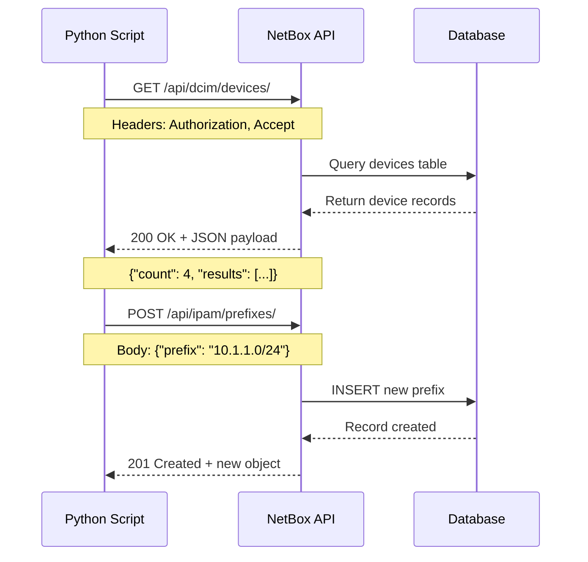

<!--
author:   Alex "The Automator" Rivera
email:    alex.rivera@packetcoders.io
version:  1.0.0
language: en
narrator: English Male
comment:  Moving from the GUI to Programmability. Mastering REST APIs.
-->

# Session 3: Mastering REST APIs with Python

## Introduction: The Universal Language

    --{{0}}--
    Alright, team. Last time we clicked buttons in a web interface.
    Reviewing logs via GUI is punishment. Configuring via GUI is negligence.
    To automate, we need to speak the language of the web: HTTP.

    --{{1}}--
    Picture this: Your boss asks you to audit 500 devices in NetBox.
    "Get me a report: Device name, serial number, location, IP address, and warranty status."
    Via the Web UI? That's 500 clicks. Copy-paste into Excel. Format the columns. 3 hours of your life gone.

    --{{2}}--
    Via the API? 15 lines of Python. Runs in 30 seconds. Outputs CSV.
    You spend the next 2 hours and 30 minutes learning Spanish on Duolingo instead.
    This is the power of programmability.

    {{2}}
> **The Rule**: If you're doing it more than 3 times, you should be using the API.

    --{{3}}--
    REST APIs are the standard interface for modern infrastructure.
    NetBox has one. Arista EOS has one. Even Cisco IOS-XE has one (Restconf).
    If you know REST, you can control the world.

## REST 101: Verbs and Nouns

    --{{0}}--
    REST (Representational State Transfer) is simple. It's just a conversation.
    You use a **Verb** (Method) to do something to a **Noun** (URL/Resource).
    RESTful APIs are stateless, cacheable, and follow a client-server architecture.

    --{{1}}--
    Think of REST like ordering at a restaurant:
    - **GET**: "Show me the menu" (read only, doesn't change anything)
    - **POST**: "I'd like to order a burger" (create something new)
    - **PUT**: "Replace my entire order with a salad instead" (replace)
    - **PATCH**: "Add extra cheese to my burger" (modify)
    - **DELETE**: "Cancel my order" (remove)

    {{1}}
### REST Request/Response Flow


    --{{2}}--
    **The HTTP Verbs (Methods):**
    *   **GET**: Retrieve a resource (Safe, Idempotent)
    *   **POST**: Create a new resource
    *   **PUT**: Replace an entire resource (Idempotent)
    *   **PATCH**: Partially update a resource
    *   **DELETE**: Remove a resource (Idempotent)
    *   **HEAD**: Like GET, but only headers (no body)
    *   **OPTIONS**: List supported methods

    --{{2}}--
    **HTTP Status Codes** (The full story):
    *   **2xx Success**:
        - 200 OK: Standard success
        - 201 Created: Resource created successfully
        - 204 No Content: Success, but no body returned
    *   **3xx Redirection**:
        - 301 Moved Permanently
        - 304 Not Modified (Cache hit)
    *   **4xx Client Errors**:
        - 400 Bad Request: Invalid syntax
        - 401 Unauthorized: Authentication required
        - 403 Forbidden: Authenticated but not authorized
        - 404 Not Found: Resource doesn't exist
        - 429 Too Many Requests: Rate limit exceeded
    *   **5xx Server Errors**:
        - 500 Internal Server Error
        - 502 Bad Gateway
        - 503 Service Unavailable

## Lab 3.1: Exploration with Postman

    --{{0}}--
    Before we write code, we explore.
    Open Postman or your terminal.
    We need an API Token from your NetBox profile.

    --{{1}}--
    Let's check if NetBox is alive.
    Method: `GET`
    URL: `http://netbox/api/status/`
    Header: `Authorization: Token <YOUR_TOKEN>`

    {{1}}
> **Task**: Perform a GET request to `/api/dcim/devices/`. Look at the JSON response. Identify the `count` and the list of `results`.

## Lab 3.2: Python `requests` (The Real Work)

    --{{0}}--
    Now let's do it in Python.
    The `requests` library is the de facto standard for HTTP in Python.
    It's elegant, powerful, and handles all the complexity for you:
    - Automatic JSON encoding/decoding
    - Connection pooling and keep-alive
    - Cookie persistence
    - SSL/TLS verification
    - Timeout handling
    - Automatic retries (with urllib3)

    --{{1}}--
    **Before you knew APIs** (the old way):
    ```python
    # Log into NetBox web UI
    # Navigate to Devices page
    # Click each device one by one
    # Copy device name into spreadsheet
    # Copy IP address into spreadsheet
    # Repeat 500 times
    # Time: 3 hours. Errors: Many.
    ```

    --{{2}}--
    **After you learn APIs** (the new way):
    ```python
    import requests
    devices = requests.get(
        'http://netbox/api/dcim/devices/',
        headers={'Authorization': f'Token {token}'}
    ).json()['results']
    
    for device in devices:
        print(f"{device['name']},{device['primary_ip']['address']}")
    # Time: 30 seconds. Errors: Zero.
    ```

    --{{3}}--
    Here is the skeleton of every API script you will ever write.
    This pattern works for NetBox, AWS, Azure, any REST API.

```python
import requests
import json

url = "http://netbox/api/dcim/devices/"
token = "0123456789abcdef0123456789abcdef01234567"

headers = {
    "Authorization": f"Token {token}",
    "Content-Type": "application/json",
    "Accept": "application/json"
}

response = requests.get(url, headers=headers)

if response.status_code == 200:
    data = response.json()
    print(f"Found {data['count']} devices.")
    for device in data['results']:
        print(f"- {device['name']} ({device['device_type']['model']})")
else:
    print(f"Error: {response.status_code}")
    print(response.text)
```

    --{{4}}--
    **Advanced `requests` features you'll use in production:**
    ```python
    # Sessions (connection pooling + persistent cookies)
    session = requests.Session()
    session.headers.update({'Authorization': f'Token {token}'})
    
    # Timeout (don't wait forever)
    response = session.get(url, timeout=10)
    
    # SSL verification (disable for self-signed certs in lab)
    response = session.get(url, verify=False)
    
    # Automatic retries
    from requests.adapters import HTTPAdapter
    from urllib3.util.retry import Retry
    
    retry_strategy = Retry(
        total=3,
        backoff_factor=1,
        status_forcelist=[429, 500, 502, 503, 504]
    )
    adapter = HTTPAdapter(max_retries=retry_strategy)
    session.mount("http://", adapter)
    session.mount("https://", adapter)
    ```

    {{1}}
> **Task**: Write a script `get_devices.py` that lists all devices in the `NYC-DataCenter` site. Hint: Add `?site=nyc-datacenter` to the URL.

## Lab 3.3: Creating Data (The POST)

    --{{0}}--
    Reading is safe. Writing is where engineers are made.
    Let's create a new Prefix (Subnet) via Python.

    --{{1}}--
    To `POST`, we need a **payload**. This is the data we are sending, formatted as a Python dictionary (which `requests` converts to JSON).

```python
url = "http://netbox/api/ipam/prefixes/"
payload = {
    "prefix": "192.168.100.0/24",
    "site": {"slug": "nyc-datacenter"},
    "status": "active",
    "description": "Created via Python API"
}

response = requests.post(url, headers=headers, json=payload)

if response.status_code == 201:
    print("Success! Prefix created.")
    print(response.json())
```

    {{1}}
> **Task**: Write a script `add_prefix.py` that creates a loopback prefix `10.255.0.1/32` for `nyc-spine-01`.

## Lab 3.4: Error Handling & Best Practices

    --{{0}}--
    Happy path scripting is script kiddie stuff.
    What if the token is wrong? What if the prefix already exists?
    Production code handles failure gracefully.

    --{{1}}--
    Always check `response.status_code`.
    If you try to create the same prefix twice, NetBox will return `400 Bad Request`.
    Your script should catch this.

```python
# ... inside the POST logic
if response.status_code == 201:
    print("Success! Resource created.")
elif response.status_code == 400:
    errors = response.json()
    if "prefix" in errors and "already exists" in str(errors):
        print("Warning: This prefix already exists. Skipping.")
    else:
        print(f"Validation error: {errors}")
elif response.status_code == 401:
    print("Error: Invalid API token. Check your credentials.")
elif response.status_code == 403:
    print("Error: Authenticated but not authorized for this action.")
elif response.status_code == 429:
    print("Error: Rate limit exceeded. Slow down your requests.")
else:
    print(f"Unexpected error {response.status_code}: {response.text}")
```

    {{1}}
> **Task**: Modify your script to be idempotent (check if it exists first, or handle the error gracefully).

## Common Pitfalls & API Best Practices

    --{{0}}--
    Let me save you from the mistakes I made when I started with APIs.

    {{0}}
### ❌ Common Mistakes

**1. Hardcoding API tokens in scripts**
```python
# BAD: Token exposed in code, committed to Git
token = "0123456789abcdef0123456789abcdef01234567"

# GOOD: Use environment variables
import os
token = os.getenv('NETBOX_TOKEN')
if not token:
    raise ValueError("NETBOX_TOKEN environment variable not set")
```

**2. Not handling pagination**
```python
# BAD: Only gets first 50 results (NetBox default page size)
devices = requests.get(url).json()['results']

# GOOD: Loop through all pages
devices = []
url = "http://netbox/api/dcim/devices/"
while url:
    response = requests.get(url, headers=headers).json()
    devices.extend(response['results'])
    url = response['next']  # Next page URL or None
```

**3. Ignoring rate limits**
```python
# BAD: Hammer the API with 1000 requests
for i in range(1000):
    requests.post(url, json=payload)
# Result: 429 Too Many Requests, possibly banned

# GOOD: Add delays, batch operations
import time
for i in range(1000):
    requests.post(url, json=payload)
    time.sleep(0.1)  # 100ms delay
```

**4. Not using SSL verification in production**
```python
# OK in lab: verify=False for self-signed certs
requests.get(url, verify=False)

# PRODUCTION: Always verify, or provide cert bundle
requests.get(url, verify='/path/to/ca-bundle.crt')
```

**5. Not logging API interactions**
```python
# BAD: Silent failures
response = requests.post(url, json=payload)

# GOOD: Log everything for debugging
import logging
logging.basicConfig(level=logging.INFO)
logger = logging.getLogger(__name__)

logger.info(f"POST {url}")
logger.debug(f"Payload: {payload}")
response = requests.post(url, json=payload)
logger.info(f"Response: {response.status_code}")
if response.status_code >= 400:
    logger.error(f"Error: {response.text}")
```

    {{1}}
### ✅ Best Practices

**1. Use Sessions for multiple requests**
```python
# Reuses TCP connection, faster for bulk operations
session = requests.Session()
session.headers.update({'Authorization': f'Token {token}'})

for device in devices_list:
    session.post(url, json=device)  # Same connection
```

**2. Implement exponential backoff for retries**
```python
import time
import random

def api_call_with_retry(url, max_retries=3):
    for attempt in range(max_retries):
        response = requests.get(url)
        if response.status_code == 200:
            return response
        elif response.status_code == 429:
            wait = (2 ** attempt) + random.uniform(0, 1)
            print(f"Rate limited. Waiting {wait:.2f}s...")
            time.sleep(wait)
        else:
            break
    raise Exception(f"Failed after {max_retries} attempts")
```

**3. Validate data before sending**
```python
import ipaddress

def create_prefix(prefix_str):
    # Validate before API call
    try:
        ipaddress.ip_network(prefix_str)
    except ValueError as e:
        print(f"Invalid prefix: {e}")
        return
    
    # Now make the API call
    response = requests.post(url, json={'prefix': prefix_str})
```

**4. Use `response.raise_for_status()`**
```python
# Automatically raises HTTPError for 4xx/5xx responses
try:
    response = requests.get(url)
    response.raise_for_status()  # Raises if status >= 400
    data = response.json()
except requests.exceptions.HTTPError as e:
    print(f"HTTP error: {e}")
except requests.exceptions.RequestException as e:
    print(f"Request failed: {e}")
```

**5. Document your API scripts**
```python
"""
NetBox Device Auditor

Retrieves all devices from NetBox and generates a CSV report.

Environment variables required:
- NETBOX_URL: Base URL of NetBox instance
- NETBOX_TOKEN: API authentication token

Usage:
    python audit_devices.py > devices_report.csv
"""
```

## Wrap-up

    --{{0}}--
    You just spoke to the machine in its native tongue.
    You didn't click a mouse. You defined state in code and pushed it to the system.
    This is the core loop of everything we do next.

    --{{1}}--
    Next time: **GraphQL**. Because sometimes REST gives you too much data, and we like efficiency.
