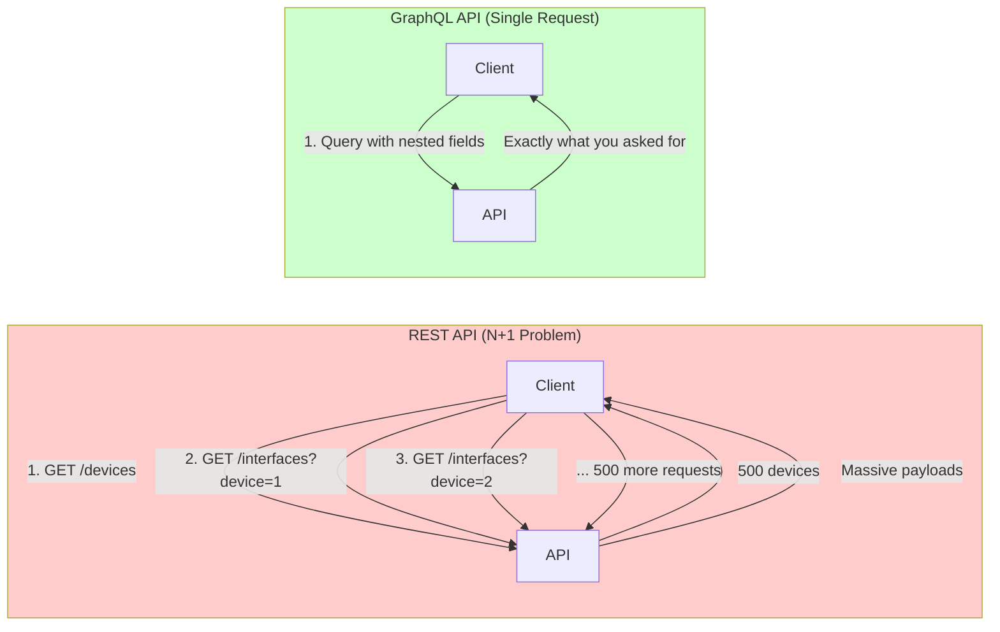

<!--
author:   Alex "The Automator" Rivera
email:    alex.rivera@packetcoders.io
version:  1.0.0
language: en
narrator: English Male
comment:  Stop overfetching. Ask for what you need. NetBox GraphQL API.
-->

# Session 4: GraphQL - The Efficient Alternative

## Introduction: The Problem with REST

    --{{0}}--
    REST is the workhorse of the web, but it's not perfect.
    Let me tell you about the time I needed to generate an inventory report for 500 devices.
    Simple requirement: Device name, rack location, management IP, and interface count.

    --{{1}}--
    **Using REST**, I had to:
    1. GET `/dcim/devices/` → 500 devices, but no interface count
    2. For each device, GET `/dcim/interfaces/?device_id=X` → 500 more requests
    3. Parse through massive JSON payloads, throwing away 90% of the data
    4. **Total**: 1000+ HTTP requests, 45 seconds, 12 MB of data transferred

    --{{2}}--
    **Using GraphQL**, I wrote:
    ```graphql
    { device_list { name rack{name} primary_ip4{address} interface_count } }
    ```
    **Total**: 1 HTTP request, 2 seconds, 85 KB of data transferred.
    That's a **22x speed improvement** and **140x less bandwidth**.

    {{2}}
> **Reality**: The right tool for the job matters. A LOT.

    --{{3}}--
    REST has three classic problems:
    1. **Overfetching**: Getting more data than you need
    2. **Underfetching**: Not getting enough, requiring multiple requests (N+1 problem)
    3. **Versioning**: Breaking changes require new API versions (/v1, /v2, /v3...)

    --{{4}}--
    In REST, you `GET /dcim/devices/`.
    NetBox sends you back a huge JSON block for each device.
    Created date, last updated, tags, custom fields, rack face, position, comments, tenant...
    I just wanted the name and IP! That's **Overfetching**.
    You waste bandwidth, CPU, and time parsing data you'll throw away.

    --{{2}}--
    Or worse. You get the device, but the interface info is a separate link.
    So you have to make another call. Then another for the IP.
    That's **Underfetching** (the N+1 problem).
    For 100 devices, that's 200+ HTTP requests. Slow and inefficient.

    --{{3}}--
    GraphQL solves this with a **single endpoint** and a **query language**.
    You ask for exactly what you need, in one request.
    No overfetching. No underfetching. Just data.

    {{3}}
### REST vs GraphQL: The Visual Difference


    --{{4}}--
    **The Math:**
    - REST for 500 devices: 1 + 500 requests = **501 HTTP calls**
    - GraphQL for 500 devices: **1 HTTP call**
    - Time saved: Dozens of seconds per report
    - Complexity reduced: Write the query once, get exactly what you need

## GraphQL 101: Ask for What You Want

    --{{0}}--
    GraphQL is a **strongly-typed query language** for APIs.
    Developed by Facebook in 2012, open-sourced in 2015.
    Key principles:
    - **Product-centric**: Built for frontend developers
    - **Hierarchical**: Queries match UI structure
    - **Strong typing**: Every field has a type
    - **Client-specified**: You control what you get
    - **Self-documenting**: Schema introspection built-in

    --{{1}}--
    **The GraphQL Type System:**
    - **Scalar types**: String, Int, Float, Boolean, ID
    - **Object types**: Custom types with fields
    - **Query**: Read operations (like GET)
    - **Mutation**: Write operations (POST/PUT/DELETE)
    - **Subscription**: Real-time updates (WebSocket)
    - **Interfaces**: Shared fields across types
    - **Unions**: One of several types
    - **Enums**: Predefined values

    --{{2}}--
    You send a shape, and the server fills it with data.
    Single endpoint: `/graphql`. Always `POST`.

    --{{3}}--
    If I want the device name and platform, I ask for:
    ```graphql
    {
      device_list {
        name
        platform {
          name
        }
      }
    }
    ```
    And that is exactly what I get. Nothing more, nothing less.

    --{{4}}--
    **The shape of the query matches the shape of the response:**

    {{4}}
```ascii
QUERY (what you ask):          RESPONSE (what you get):

{                              {
  device_list {                  "data": {
    name                           "device_list": [
    platform {                       {
      name                             "name": "nyc-spine-01",
    }                                  "platform": {
  }                                      "name": "Cisco NXOS"
}                                      }
                                     },
                                     ...
                                   ]
                                 }
                               }
```

    --{{5}}--
    This is the GraphQL superpower: **Predictability**.
    You write the shape, you get that shape. No surprises.

## Lab 4.1: The GraphiQL Explorer

    --{{0}}--
    NetBox has a built-in playground.
    Navigate to the bottom right of your NetBox UI, look for "GraphQL API" or go to `/graphql/`.

    --{{1}}--
    This is **GraphiQL**. It has autocomplete.
    Try this query:

```graphql
query {
  device_list(site: "nyc-datacenter") {
    name
    serial
    primary_ip4 {
      address
    }
    rack {
      name
    }
  }
}
```

    --{{2}}--
    Hit Play.
    Notice how it traverses relationships? From Device -> IP. From Device -> Rack.
    In REST, that might have been 3 different API calls per device.

    {{1}}
> **Task**: Build a query that lists all `interfaces` in `nyc-datacenter` that are `connected`. Return the interface name and the connected peer's name.

## Lab 4.2: GraphQL in Python

    --{{0}}--
    How do we script this?
    There are fancy libraries (GQL), but usually, `requests` is enough.
    A GraphQL query is just a JSON string sent to the endpoint.

    --{{1}}--
    Let's translate our GraphiQL work to Python.

```python
import requests
import json

url = "http://netbox/graphql/"
headers = {"Authorization": "Token ..."}

query = """
query {
  device_list(role: "spine-switch") {
    name
    primary_ip4 {
      address
    }
  }
}
"""

response = requests.post(url, headers=headers, json={'query': query})
print(json.dumps(response.json(), indent=2))
```

    {{1}}
> **Task**: Write `inventory_report.py`. Use GraphQL to fetch a clean list of `Device | Role | Management IP` and export it to a CSV file.

## Lab 4.3: Variables (The Pro Move)

    --{{0}}--
    Don't string-concatenate your queries. That's ugly and dangerous.
    Use **Variables**.

    --{{1}}--
    In your query:
    `query getDevices($site: String!) { device_list(site: $site) { ... } }`

    --{{2}}--
    In requests:
    `json={'query': query, 'variables': {'site': 'nyc-datacenter'}}`

    {{1}}
> **Task**: Update your script to accept a Site Name as a command-line argument and pass it as a GraphQL variable.

## Common Pitfalls & GraphQL Best Practices

    --{{0}}--
    GraphQL is powerful, but with great power comes... new ways to shoot yourself in the foot.

    {{0}}
### ❌ Common Mistakes

**1. Not using fragments for repeated fields**
```graphql
# BAD: Repeating the same fields
query {
  spine_devices: device_list(role: "spine") {
    name
    serial
    primary_ip4 { address }
  }
  leaf_devices: device_list(role: "leaf") {
    name
    serial
    primary_ip4 { address }
  }
}

# GOOD: Use fragments
fragment deviceFields on DeviceType {
  name
  serial
  primary_ip4 { address }
}

query {
  spine_devices: device_list(role: "spine") { ...deviceFields }
  leaf_devices: device_list(role: "leaf") { ...deviceFields }
}
```

**2. Over-nesting queries (performance killer)**
```graphql
# DANGEROUS: This could fetch thousands of objects
query {
  device_list {
    name
    interfaces {
      name
      ip_addresses {
        address
        vrf {
          name
          prefixes {
            prefix  # This explodes exponentially!
          }
        }
      }
    }
  }
}
# Result: Query timeout, API server overload
```

**3. Not handling GraphQL errors properly**
```python
# BAD: Assumes success
data = response.json()['data']

# GOOD: Check for errors
result = response.json()
if 'errors' in result:
    for error in result['errors']:
        print(f"GraphQL Error: {error['message']}")
    sys.exit(1)
data = result.get('data')
```

**4. Forgetting field arguments**
```graphql
# BAD: Gets ALL devices (thousands)
query {
  device_list {
    name
  }
}

# GOOD: Filter at query time
query {
  device_list(site: "nyc-datacenter", role: "spine") {
    name
  }
}
```

    {{1}}
### ✅ Best Practices

**1. Use operation names (especially for debugging)**
```graphql
# Instead of anonymous queries
{ device_list { name } }

# Use named operations
query GetDeviceNames {
  device_list {
    name
  }
}
# Benefits: Better logging, easier debugging, self-documenting
```

**2. Leverage variables for dynamic queries**
```python
# Secure and clean
query = """
query GetDevicesBySite($siteName: String!, $limit: Int) {
  device_list(site: $siteName) {
    name
    primary_ip4 { address }
  }
}
"""

variables = {
    'siteName': user_input,  # Safe from injection
    'limit': 100
}

response = requests.post(url, json={
    'query': query,
    'variables': variables
})
```

**3. Request only the fields you need**
```graphql
# Don't be greedy - each field has a cost
query {
  device_list {
    name              # ✓ Need this
    primary_ip4 {     # ✓ Need this
      address
    }
    # serial          # ✗ Don't need, don't fetch
    # asset_tag       # ✗ Wasting bandwidth
    # comments        # ✗ Unnecessary load
  }
}
```

**4. Use aliases for multiple queries**
```graphql
query {
  nyc_spines: device_list(site: "nyc-datacenter", role: "spine") {
    name
  }
  nyc_leafs: device_list(site: "nyc-datacenter", role: "leaf") {
    name
  }
}
# Returns: { "nyc_spines": [...], "nyc_leafs": [...] }
```

**5. Introspection for API discovery**
```graphql
# What fields are available on Device?
query {
  __type(name: "DeviceType") {
    fields {
      name
      type {
        name
      }
    }
  }
}
# GraphQL APIs are self-documenting!
```

**6. Pagination for large datasets**
```python
# NetBox GraphQL doesn't paginate by default (unlike REST)
# Always set a reasonable limit
query = """
query {
  device_list(limit: 100) {  # Don't fetch 10,000 devices at once
    name
  }
}
"""
```

## When to Use GraphQL vs REST

    --{{0}}--
    Both are tools. Choose wisely.

    {{0}}
### Use GraphQL when:
- **Complex data relationships**: Need device + interfaces + IPs in one call
- **Custom reporting**: Different views need different fields
- **Mobile/slow networks**: Minimize data transfer
- **Rapid prototyping**: Explore API without reading docs

    {{1}}
### Use REST when:
- **Simple CRUD**: Creating/updating single objects
- **File uploads**: REST handles multipart better
- **Caching**: HTTP caching works out-of-the-box
- **Standard tools**: curl, Postman, browser dev tools

    {{2}}
### The Hybrid Approach (Recommended):
```python
# Use REST for writes (idempotent, cacheable)
requests.post('/api/dcim/devices/', json=device_data)

# Use GraphQL for reads (efficient, flexible)
requests.post('/graphql/', json={
    'query': '{ device_list { name primary_ip4{address} } }'
})
```

## Wrap-up

    --{{0}}--
    You now have two powerful ways to get data.
    **REST** for simple CRUD (Create/Update).
    **GraphQL** for complex Data Fetching and Reporting.

    --{{1}}--
    Now that we can get data *out* of the system, we need to generate configurations *for* the system.
    Next up: **Jinja2**. We stop writing configs by hand.
